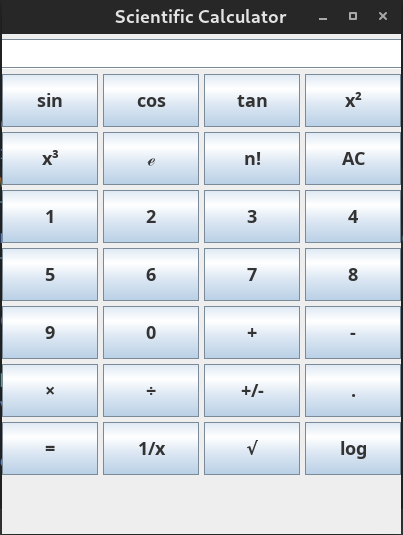

# Scientific Calculator

A scientific calculator with minimum features created with Java Swings. This was made for assignment on Object-Oriented Concepts (18CS45) VTU Course (IVth sem -  2nd year).

## Output:

